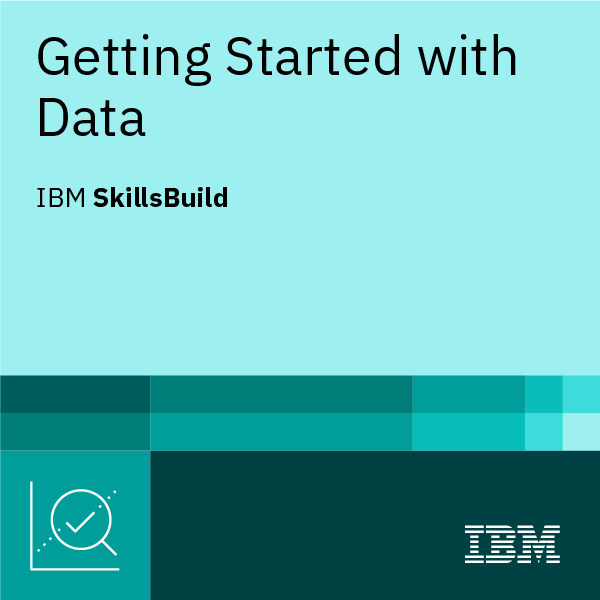

  

## Oi, me chamo Eduardo Koehler, nasci em 2011, e estou cursando infonet na ETECVAV! 👋

# 💫 About Me:
- 🔭 Estou trabalhando atualmente com: nada - 🌱 Estou aprendendo informática para internet na etecvav - 🤔 Tiro minhas dúvidas com meus professores - 💬 Me pergunte sobre: --- - 😄 Pronomes: ele/dele - ⚡ Curiosidades: Gosto de sertanejo 

<h1 align="center"> 💳 Certificados</h1>

# 💻 Tech Stack:
    
# 📊 GitHub Stats:
 
 

## 🏆 GitHub Trophies

### ✍️ Random Dev Quote

### 🔝 Top Contributed Repo

---

<!-- Proudly created with GPRM ( https://gprm.itsvg.in ) -->

