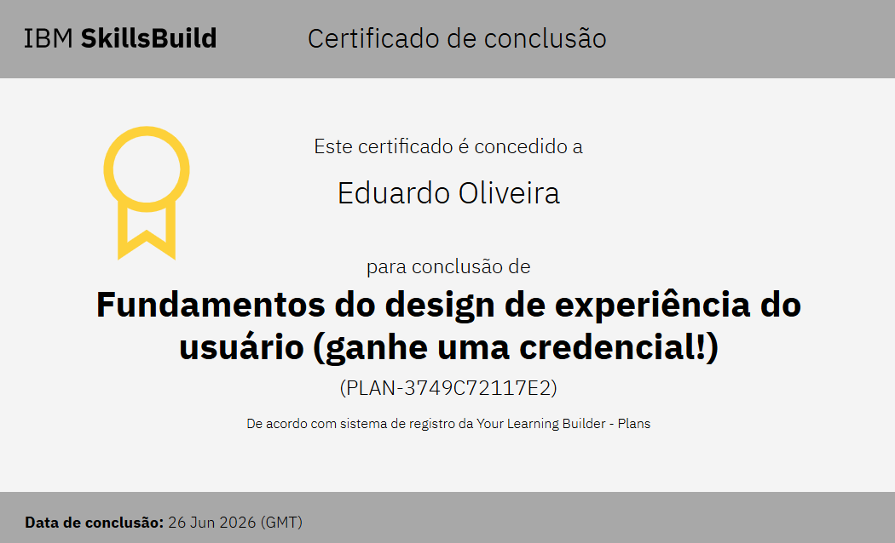
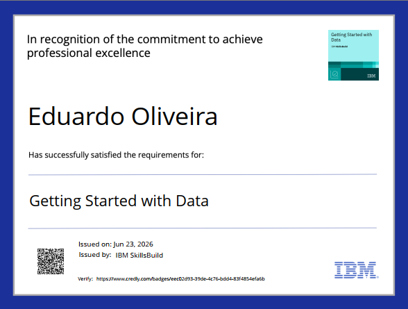
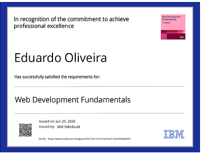
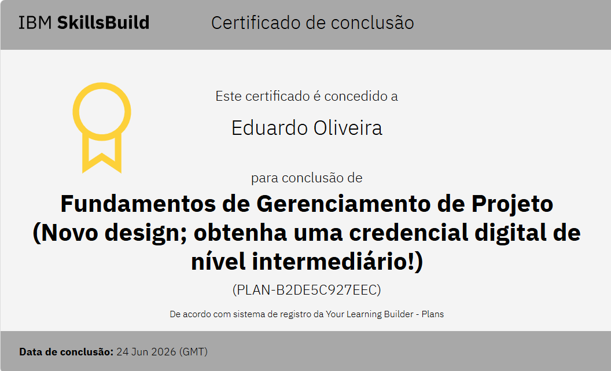

  
  
  
  

<h1 align="center"> 💳 Emblemas/Certificados</h1>

  

<h1 align="center">👥 Grupos em que Participo</h1>

<table>
  <tr>
    <td align="center">
      
    </td>
    <td align="center">
      
    </td>
  </tr>

  <tr>
    <td align="center">
      <a href="https://github.com/dudugigi2026-max">Dupla</a>
    </td>
    <td align="center">
      <a href="https://github.com/EduDaviJoaoGigi">Quarteto</a>
    </td>
  </tr>
</table>

  

<h1 align="center"> 🐍 "Jogo da Cobrinha"</h1>

  

# **Eduardo Koehler**

# 👋 Olá, eu curso Informática para Internet na ETECVAV

### 💻 Desenvolvedor Web

Apaixonado por tecnologia e programação. 
Crio soluções web modernas e eficientes.

---

<h2 align="center">👨‍💻 Sobre mim</h2>

🔭 Estou trabalhando atualmente com: Sem emprego  - 🌱 Estou aprendendo informática para internet na etecvav - 🤔 Tiro minhas dúvidas com meus professores - 💬 Me pergunte sobre: O que você quiser  - 😄 Pronomes: ele/dele - ⚡ Curiosidades: Gosto de sertanejo 
  

  
  
  
  

---

<h2 align="center">🚀 Projetos</h2>

<table>
<tr>

<td align="center" width="33%">

### 💻 Projeto 1

Descrição breve do projeto.

</td>

<td align="center" width="33%">

### 🌱 Projeto 2

Descrição breve do projeto.

</td>

<td align="center" width="33%">

### 🎮 Projeto 3

Descrição breve do projeto.

</td>

</tr>
</table>

---

<h2 align="center">🛠️ Habilidades</h2>

 

| Tecnologia | Nível |
|:---:|:---:|
| HTML | ⭐⭐⭐⭐⭐ |
| CSS | ⭐⭐⭐⭐ |
| JavaScript | ⭐⭐⭐ |
| Python | ⭐⭐⭐ |
| Git | ⭐⭐⭐⭐ |

---

<h2 align="center">📊 GitHub</h2>

  

---

<h2 align="center">📚 Matérias</h2>

---

<h2 align="center" id="contato">📫 Contato</h2>

---

### ⭐ Obrigado por visitar meu perfil!

 

  

**© 2026 SEU NOME**

